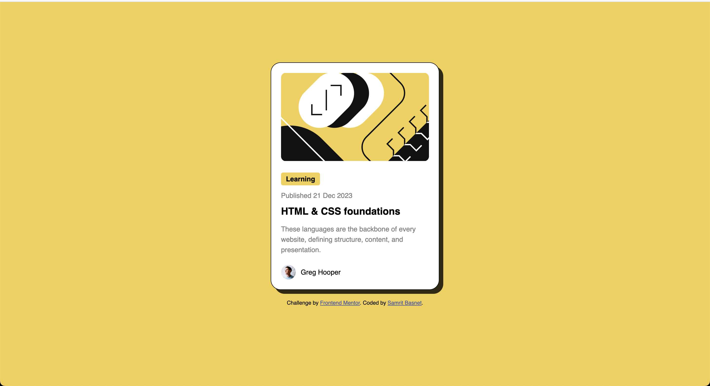

# Frontend Mentor - Blog preview card solution

This is a solution to the [Blog preview card challenge on Frontend Mentor](https://www.frontendmentor.io/challenges/blog-preview-card-ckPaj01IcS). Frontend Mentor challenges help you improve your coding skills by building realistic projects.

### The challenge

Users should be able to:

- See hover and focus states for all interactive elements on the page

### Screenshot

### Links

- Solution URL: (https://github.com/samritbasnet/blog-preview-card)
  -Live URL:(https://blog-preview-card-2v17n6sq6-samritbasnets-projects.vercel.app/)

## My process

### Built with

- Semantic HTML5 markup
- CSS custom properties
- Flexbox
- CSS Grid
- Mobile-first workflow

### What I learned

I learned about flexbox,and some ways to add hover effect on text and finally right way to give border radius.
.title:hover {
color: hsl(47, 88%, 63%);
cursor: pointer;
}

body {
background-color: hsl(47, 88%, 63%);
font-family: "Figtree", sans-serif;
font-size: 14px;
display: flex;
flex-direction: column;
justify-content: center;
align-items: center;
min-height: 100vh;
margin: 0;
padding: 20px;
}

### Continued development

I am still not comfortable with flexbox and setting right margin and padding for the properties.

### Useful resources

- [Flextbox](https://css-tricks.com/snippets/css/a-guide-to-flexbox/) - This helped me for learning flexbox and other Css property I really liked the visual paradigm pattern which makes it intresting to understand.

- Frontend Mentor - [@yourusername](https://www.frontendmentor.io/profile/samritbasnet)
- Twitter - [@yourusername](https://www.twitter.com/samritbasnet70)
# blog-preview
